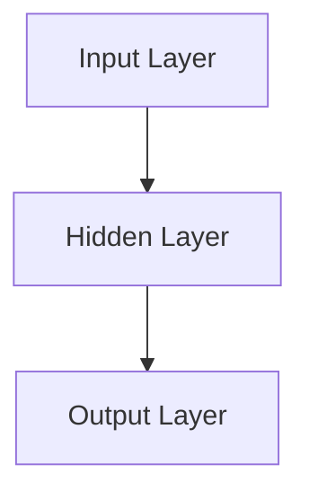
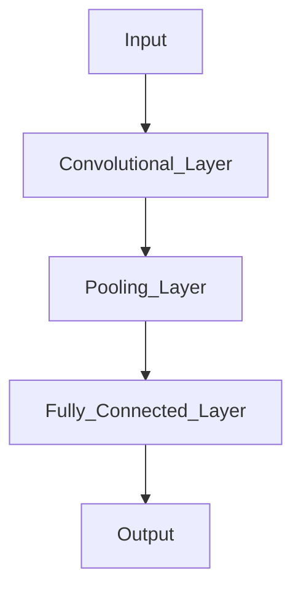
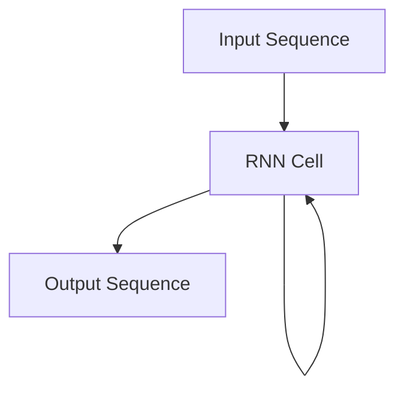
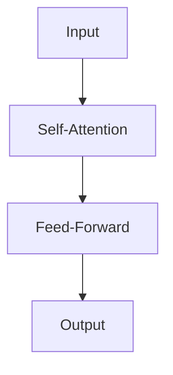
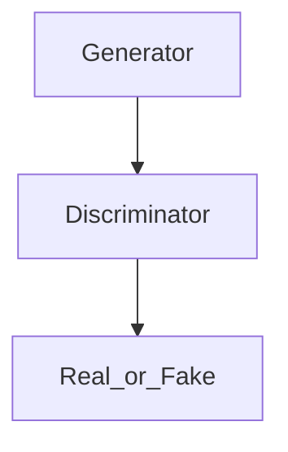

# Understanding Neural Networks: From Basics to Advanced Concepts

## Introduction to Neural Networks

Neural networks are a cornerstone of artificial intelligence (AI) and machine learning, mimicking the way human brains process information. At their core, neural networks are computational models designed to recognize patterns and solve complex problems by learning from data. They consist of interconnected layers of nodes, or "neurons," which work together to transform input data into meaningful output.

### A Brief History and Evolution

The concept of neural networks dates back to the 1940s, with the introduction of the perceptron by Frank Rosenblatt in 1958 marking a significant milestone. Initially, neural networks faced limitations due to computational constraints and a lack of understanding of their potential. However, the resurgence of interest in the 1980s, fueled by advancements in algorithms and hardware, led to the development of more sophisticated models. Today, neural networks are at the forefront of AI research, powering innovations in fields such as computer vision, natural language processing, and autonomous systems.

### Comparison with Traditional Machine Learning

Traditional machine learning algorithms, such as decision trees and support vector machines, rely on manually crafted features and often require domain expertise to perform well. In contrast, neural networks automatically learn hierarchical feature representations from raw data, making them highly adaptable and capable of handling complex tasks. This ability to learn directly from data has made neural networks particularly effective in areas where traditional methods struggle.

### Overview of Blog Structure and Learning Outcomes

This blog will guide you through the fascinating world of neural networks, starting with the basics and gradually introducing advanced concepts. We'll explore the architecture of neural networks, including neurons, layers, weights, biases, and activation functions. You'll learn about the training process, including forward propagation, backpropagation, and gradient descent. We'll also discuss common challenges and real-world applications, providing practical examples and Python code to solidify your understanding.

By the end of this blog, you'll have a comprehensive understanding of how neural networks learn and make predictions, equipping you with the knowledge to apply these powerful tools in your own projects. Whether you're a beginner or an advanced learner, this journey through neural networks promises to be both educational and engaging.

## Intuition Behind Neural Networks

Neural networks, inspired by the human brain, are at the heart of many modern AI applications. They are designed to recognize patterns and make decisions, much like how our brain processes information. Let's delve into the basic intuition and components of neural networks to understand how they function.

### Analogy with the Human Brain

Imagine the human brain, a complex network of billions of neurons, each connected to thousands of others. These neurons communicate through electrical signals, allowing us to perceive, think, and act. Similarly, artificial neural networks consist of interconnected nodes, or "neurons," that process information and learn from data.

### Basic Components: Neurons, Layers, Weights, and Biases

#### Neurons

In a neural network, a neuron is a computational unit that receives input, processes it, and produces an output. Each neuron takes multiple inputs, applies a mathematical operation, and passes the result through an activation function to produce an output.

#### Layers

Neurons are organized into layers. A typical neural network consists of an input layer, one or more hidden layers, and an output layer. The input layer receives the raw data, hidden layers perform computations, and the output layer produces the final result.

#### Weights and Biases

Weights and biases are crucial parameters in a neural network. Weights determine the strength of the connection between neurons, while biases allow the model to shift the activation function, enabling it to fit the data better. During training, the network adjusts these weights and biases to minimize the error in predictions.

### Role of Activation Functions

Activation functions introduce non-linearity into the network, enabling it to learn complex patterns. Without activation functions, a neural network would behave like a linear model, limiting its ability to solve complex problems. Common activation functions include the sigmoid, tanh, and ReLU (Rectified Linear Unit).

#### Simple Example to Illustrate Concepts

Consider a simple neural network with one input layer, one hidden layer, and one output layer. Suppose we want to predict whether a student will pass an exam based on hours studied and hours slept. Each input (hours studied and hours slept) is multiplied by a weight, summed with a bias, and passed through an activation function to produce an output.

Here's a basic representation of this process:

```plaintext
Input: [Hours Studied, Hours Slept]
Weights: [w1, w2]
Bias: b
Activation Function: ReLU

Output = ReLU(w1 * Hours Studied + w2 * Hours Slept + b)
```

This simple example illustrates how neural networks transform inputs into outputs through layers of neurons, weights, biases, and activation functions.

In summary, neural networks mimic the human brain's ability to learn from data. By understanding the basic components and their roles, we can appreciate how these powerful models recognize patterns and make predictions. As we progress, we'll explore more advanced concepts and architectures that enhance the capabilities of neural networks.

## Mathematics of Neural Networks

Understanding the mathematical foundation of neural networks is crucial for grasping how these models learn and make predictions. In this section, we'll explore the mathematical representation of neurons, the significance of weights and biases, and the role of activation functions in neural networks. We'll also walk through a simple example to illustrate these concepts.

### Mathematical Representation of Neurons

At the heart of a neural network is the neuron, a fundamental unit that mimics the behavior of a biological neuron. Mathematically, a neuron can be represented as a function that takes inputs, applies weights and biases, and produces an output. The basic equation for a neuron is:

\[ z = \sum_{i=1}^{n} w_i \cdot x_i + b \]

Where:
- \( z \) is the weighted sum of inputs.
- \( w_i \) represents the weights associated with each input \( x_i \).
- \( b \) is the bias term, which allows the model to fit the data better by shifting the activation function.

### Understanding Weights and Biases Mathematically

Weights and biases are crucial parameters in a neural network. They determine how inputs are transformed into outputs. Weights are coefficients for each input feature, and they signify the importance of each feature in predicting the output. Biases, on the other hand, allow the model to adjust the output independently of the input, providing additional flexibility.

In a neural network, learning involves adjusting these weights and biases to minimize the error between the predicted and actual outputs. This adjustment is typically done using optimization algorithms like gradient descent.

### Role of Activation Functions in Equations

Once the weighted sum \( z \) is calculated, it is passed through an activation function to introduce non-linearity into the model. Activation functions are crucial because they enable the network to learn complex patterns. Common activation functions include:

- **Sigmoid**: \( \sigma(z) = \frac{1}{1 + e^{-z}} \)
- **ReLU (Rectified Linear Unit)**: \( f(z) = \max(0, z) \)
- **Tanh**: \( \tanh(z) = \frac{e^z - e^{-z}}{e^z + e^{-z}} \)

Each activation function has its characteristics and is chosen based on the specific requirements of the model.

### Example with Simple Calculations

Let's consider a simple example with a single neuron to illustrate these concepts. Suppose we have two inputs, \( x_1 = 0.5 \) and \( x_2 = 0.8 \), with weights \( w_1 = 0.4 \) and \( w_2 = 0.6 \), and a bias \( b = 0.1 \).

First, we calculate the weighted sum:

\[ z = (0.4 \times 0.5) + (0.6 \times 0.8) + 0.1 = 0.2 + 0.48 + 0.1 = 0.78 \]

Next, we apply an activation function. Using the sigmoid function:

\[ \sigma(z) = \frac{1}{1 + e^{-0.78}} \approx 0.685 \]

Thus, the output of the neuron is approximately 0.685.

This simple example demonstrates how inputs are transformed through weights, biases, and activation functions to produce an output. As we delve deeper into neural networks, these mathematical foundations will help us understand more complex architectures and learning processes.

## Architecture of Neural Networks

Understanding the architecture of neural networks is crucial for grasping how these powerful models process and learn from data. At their core, neural networks are inspired by the human brain, consisting of interconnected neurons that work together to solve complex problems. Let's delve into the basic structure of neural networks, exploring the different types of layers and their roles in processing information.

### Different Types of Layers

Neural networks are composed of three primary types of layers: input, hidden, and output layers. Each layer plays a distinct role in the network's ability to learn and make predictions.

#### Input Layer

The input layer is the first layer of a neural network and serves as the entry point for the data. Each neuron in this layer represents a feature of the input data. For instance, in an image recognition task, each neuron might correspond to a pixel value. The input layer does not perform any computations; it simply passes the data to the next layer.

#### Hidden Layers

Hidden layers are where the magic happens. These layers are responsible for transforming the input data into something the network can use to make predictions. Each hidden layer consists of neurons that apply weights and biases to the inputs, followed by an activation function that introduces non-linearity. This non-linearity allows the network to learn complex patterns and relationships in the data.

The number of hidden layers and neurons in each layer can vary depending on the complexity of the task. More layers and neurons generally allow the network to capture more intricate patterns, but they also increase the risk of overfitting.

#### Output Layer

The output layer is the final layer of the network, where the transformed data is converted into a prediction. The number of neurons in the output layer corresponds to the number of classes in a classification task or the number of outputs in a regression task. For example, in a binary classification problem, the output layer might have a single neuron with a sigmoid activation function to produce a probability score.

### Role of Each Layer in Processing Information

Each layer in a neural network has a specific role in processing information:

- **Input Layer**: Receives raw data and passes it to the hidden layers.
- **Hidden Layers**: Transform the input data through weighted sums and activation functions, extracting features and patterns.
- **Output Layer**: Converts the processed data into a final prediction or decision.

### Visual Representation Using Diagrams

To better understand the architecture of neural networks, let's visualize a simple neural network using a diagram. Below is a basic representation of a neural network with one hidden layer:



In this diagram, the input layer receives data, which is then processed by the hidden layer before producing an output.

### Example of a Simple Neural Network Architecture

Consider a simple neural network designed to classify handwritten digits from the MNIST dataset. This network might have:

- An input layer with 784 neurons (one for each pixel in a 28x28 image).
- A hidden layer with 128 neurons, using the ReLU activation function.
- An output layer with 10 neurons, each representing a digit from 0 to 9, using the softmax activation function.

This architecture allows the network to learn and recognize patterns in the pixel data, ultimately classifying the images into the correct digit categories.

In summary, the architecture of neural networks is a fundamental aspect that determines their ability to learn and make predictions. By understanding the roles of different layers and how they interact, we can design networks that effectively solve a wide range of problems.

## Forward and Backpropagation in Neural Networks

Understanding the processes of forward and backpropagation is crucial for grasping how neural networks learn and make predictions. These two processes are the backbone of training neural networks, allowing them to adjust and improve over time. Let's delve into each process, starting with forward propagation.

### Forward Propagation

**Definition and Purpose:**

Forward propagation is the process by which input data is passed through the neural network to generate an output. This output is then compared to the actual target value to compute the error, which is essential for the learning process.

In simple terms, forward propagation involves feeding the input data through the network's layers, where each neuron processes the data using weights, biases, and activation functions to produce an output. This output is the network's prediction.

**Mathematical Explanation:**

Consider a simple neural network with one hidden layer. The forward propagation can be mathematically represented as follows:

1. **Input Layer to Hidden Layer:**

   \[
   z^{(1)} = W^{(1)} \cdot X + b^{(1)}
   \]

   \[
   a^{(1)} = \sigma(z^{(1)})
   \]

   Here, \( W^{(1)} \) represents the weights, \( X \) is the input, \( b^{(1)} \) is the bias, and \( \sigma \) is the activation function.

2. **Hidden Layer to Output Layer:**

   \[
   z^{(2)} = W^{(2)} \cdot a^{(1)} + b^{(2)}
   \]

   \[
   a^{(2)} = \sigma(z^{(2)})
   \]

   The output \( a^{(2)} \) is the prediction of the network.

### Backpropagation

**Understanding Backpropagation and Its Importance:**

Backpropagation is the process of updating the weights and biases of the network based on the error calculated during forward propagation. It is essential because it allows the network to learn from its mistakes and improve its predictions over time.

Backpropagation works by calculating the gradient of the loss function with respect to each weight by the chain rule, allowing the network to adjust the weights in the direction that minimizes the error.

**Mathematical Explanation:**

The backpropagation process involves the following steps:

1. **Calculate the Error:**

   The error \( E \) is calculated as the difference between the predicted output and the actual target value.

   \[
   E = \frac{1}{2} \sum (y - a^{(2)})^2
   \]

2. **Compute the Gradient:**

   Using the chain rule, compute the gradient of the error with respect to each weight:

   \[
   \frac{\partial E}{\partial W^{(2)}} = \frac{\partial E}{\partial a^{(2)}} \cdot \frac{\partial a^{(2)}}{\partial z^{(2)}} \cdot \frac{\partial z^{(2)}}{\partial W^{(2)}}
   \]

3. **Update the Weights:**

   Adjust the weights using the gradient descent algorithm:

   \[
   W^{(2)} = W^{(2)} - \eta \cdot \frac{\partial E}{\partial W^{(2)}}
   \]

   Here, \( \eta \) is the learning rate.

**Example with Step-by-Step Calculations:**

Let's consider a simple example with a single neuron. Suppose the input \( X = 0.5 \), the weight \( W = 0.8 \), the bias \( b = 0.2 \), and the target output \( y = 1 \).

1. **Forward Propagation:**

   \[
   z = W \cdot X + b = 0.8 \cdot 0.5 + 0.2 = 0.6
   \]

   \[
   a = \sigma(z) = \frac{1}{1 + e^{-0.6}} \approx 0.645
   \]

2. **Calculate Error:**

   \[
   E = \frac{1}{2} (1 - 0.645)^2 \approx 0.063
   \]

3. **Backpropagation:**

   Compute the gradient and update the weight:

   \[
   \frac{\partial E}{\partial W} = (0.645 - 1) \cdot 0.645 \cdot (1 - 0.645) \cdot 0.5 \approx -0.035
   \]

   \[
   W = 0.8 - 0.01 \cdot (-0.035) \approx 0.80035
   \]

Through these iterative steps, the network learns to minimize the error, improving its predictions over time. Understanding forward and backpropagation is fundamental to mastering neural networks and their applications in AI and machine learning.

## Gradient Descent and Training Process

In the fascinating world of neural networks, understanding how these models learn is crucial. At the heart of this learning process lies an optimization algorithm known as **gradient descent**. This section will guide you through the essentials of gradient descent, its variations, and how it fits into the broader training process of neural networks. We'll also explore some challenges you might encounter along the way.

### Introduction to Gradient Descent

Gradient descent is an optimization algorithm used to minimize the loss function of a neural network. The loss function measures how well the neural network's predictions match the actual data. By minimizing this function, we improve the model's accuracy.

Imagine you're standing on a hill and want to reach the lowest point. Gradient descent helps you find this point by taking small steps in the direction of the steepest descent. Mathematically, this involves calculating the gradient (or derivative) of the loss function with respect to the model's parameters (weights and biases) and updating these parameters iteratively.

#### LaTeX Equation for Gradient Descent

The update rule for gradient descent can be expressed as:

\[
\theta = \theta - \alpha \nabla J(\theta)
\]

Where:
- \(\theta\) represents the model parameters.
- \(\alpha\) is the learning rate, a hyperparameter that determines the step size.
- \(\nabla J(\theta)\) is the gradient of the loss function with respect to \(\theta\).

### Different Types of Gradient Descent Algorithms

There are several variations of gradient descent, each with its own advantages and trade-offs:

1. **Batch Gradient Descent**: Uses the entire dataset to compute the gradient. While accurate, it can be computationally expensive for large datasets.

2. **Stochastic Gradient Descent (SGD)**: Updates the model parameters using one data point at a time. This approach is faster but can introduce more noise in the updates.

3. **Mini-batch Gradient Descent**: A compromise between batch and stochastic gradient descent, it uses a small subset of the data to compute the gradient. This method balances speed and accuracy.

### Training Process Overview with Python Code

The training process of a neural network involves iteratively updating the model parameters using gradient descent. Here's a simplified Python example to illustrate this process:

```python
import numpy as np

# Initialize parameters
weights = np.random.rand(2, 1)
bias = np.random.rand(1)
learning_rate = 0.01

# Dummy data
X = np.array([[1, 2], [2, 3], [3, 4]])
y = np.array([[1], [0], [1]])

# Sigmoid activation function
def sigmoid(z):
    return 1 / (1 + np.exp(-z))

# Training loop
for epoch in range(1000):
    # Forward propagation
    z = np.dot(X, weights) + bias
    predictions = sigmoid(z)
    
    # Compute loss (binary cross-entropy)
    loss = -np.mean(y * np.log(predictions) + (1 - y) * np.log(1 - predictions))
    
    # Backward propagation
    dz = predictions - y
    dw = np.dot(X.T, dz) / X.shape[0]
    db = np.sum(dz) / X.shape[0]
    
    # Update parameters
    weights -= learning_rate * dw
    bias -= learning_rate * db

    if epoch % 100 == 0:
        print(f'Epoch {epoch}, Loss: {loss}')
```

### Challenges in Training Neural Networks

Training neural networks is not without its challenges. Here are a few common issues:

- **Choosing the Right Learning Rate**: A learning rate that's too high can cause the model to diverge, while a rate that's too low can slow down convergence.
- **Overfitting**: When a model learns the training data too well, it may perform poorly on unseen data. Techniques like regularization and dropout can help mitigate this.
- **Vanishing/Exploding Gradients**: In deep networks, gradients can become too small or too large, hindering effective learning. Advanced architectures like LSTMs and techniques like batch normalization address these issues.

### Key Takeaways

- Gradient descent is a fundamental algorithm for optimizing neural networks.
- Different types of gradient descent offer trade-offs between speed and accuracy.
- The training process involves iteratively updating model parameters to minimize the loss function.
- Challenges such as learning rate selection and overfitting are common but manageable with the right techniques.

By understanding and applying these concepts, you'll be well-equipped to train neural networks effectively, paving the way for more advanced explorations into deep learning architectures.

## Advanced Neural Network Architectures

As we delve deeper into the world of neural networks, we encounter a variety of advanced architectures that have revolutionized the field of artificial intelligence. These architectures, including Convolutional Neural Networks (CNNs), Recurrent Neural Networks (RNNs), Long Short-Term Memory networks (LSTMs), Transformers, and Generative Adversarial Networks (GANs), each serve unique purposes and excel in different applications. In this section, we'll explore these architectures, compare them with basic neural networks, and provide insights into their use cases.

### Convolutional Neural Networks (CNNs)

CNNs are specifically designed to process data with a grid-like topology, such as images. They are composed of convolutional layers that apply filters to input data, capturing spatial hierarchies and patterns. This makes CNNs particularly effective for image recognition and classification tasks.

#### Use Cases:
- **Image Classification**: Identifying objects within images.
- **Object Detection**: Locating objects in images.
- **Facial Recognition**: Recognizing and verifying human faces.

#### Diagram:


### Recurrent Neural Networks (RNNs)

RNNs are designed for sequential data, where the current input is dependent on previous inputs. They have loops within their architecture, allowing information to persist.

#### Use Cases:
- **Time Series Prediction**: Forecasting stock prices or weather.
- **Natural Language Processing (NLP)**: Language modeling and text generation.
- **Speech Recognition**: Converting spoken language into text.

#### Diagram:


### Long Short-Term Memory Networks (LSTMs)

LSTMs are a special kind of RNN capable of learning long-term dependencies. They are designed to avoid the long-term dependency problem, making them effective for tasks where context is crucial.

#### Use Cases:
- **Language Translation**: Translating text from one language to another.
- **Speech Synthesis**: Generating human-like speech.
- **Music Composition**: Creating new music pieces.

#### Diagram:


### Transformers

Transformers have transformed the field of NLP by enabling parallelization and handling long-range dependencies more effectively than RNNs. They use mechanisms called attention to weigh the importance of different parts of the input data.

#### Use Cases:
- **Text Summarization**: Condensing long articles into summaries.
- **Question Answering**: Providing answers to questions based on context.
- **Machine Translation**: Translating text between languages.

#### Diagram:


### Generative Adversarial Networks (GANs)

GANs consist of two neural networks, a generator and a discriminator, that compete against each other. The generator creates data, while the discriminator evaluates it, leading to the generation of highly realistic data.

#### Use Cases:
- **Image Generation**: Creating realistic images from scratch.
- **Data Augmentation**: Enhancing datasets with synthetic data.
- **Style Transfer**: Applying artistic styles to images.

#### Diagram:


### Comparison with Basic Neural Networks

While basic neural networks are powerful, they often struggle with complex data types and dependencies. Advanced architectures like CNNs and RNNs are tailored for specific data structures, such as images and sequences, providing superior performance in these domains.

### Interview Insights

When choosing the right architecture, consider the nature of your data and the problem you're solving. For instance, CNNs are ideal for image-related tasks, while RNNs and LSTMs excel in handling sequential data. Transformers are the go-to choice for NLP tasks due to their efficiency and scalability.

In conclusion, understanding these advanced architectures and their applications can significantly enhance your ability to tackle complex AI challenges. By selecting the appropriate architecture, you can leverage the full potential of neural networks to achieve remarkable results in various domains.

## Real-World Applications and Challenges of Neural Networks

Neural networks have revolutionized numerous industries by providing powerful tools for solving complex problems. From healthcare to finance, these models have demonstrated their ability to learn from data and make accurate predictions. However, implementing neural networks comes with its own set of challenges. In this section, we will explore the real-world applications of neural networks, discuss common challenges faced during implementation, and look at future trends in this rapidly evolving field.

### Applications of Neural Networks

Neural networks are being used across various industries to enhance efficiency and accuracy. Here are some notable examples:

- **Healthcare**: Neural networks are used for diagnosing diseases, predicting patient outcomes, and personalizing treatment plans. For instance, convolutional neural networks (CNNs) are employed in medical imaging to detect anomalies such as tumors in MRI scans.

- **Finance**: In the financial sector, neural networks help in fraud detection, algorithmic trading, and credit scoring. They analyze vast amounts of transaction data to identify patterns indicative of fraudulent activity.

- **Automotive**: Self-driving cars rely heavily on neural networks to process data from sensors and cameras, enabling them to navigate roads safely. Neural networks help in object detection, lane tracking, and decision-making processes.

- **Retail**: Retailers use neural networks for demand forecasting, inventory management, and personalized marketing. By analyzing customer data, these models can predict buying patterns and optimize stock levels.

- **Natural Language Processing (NLP)**: Neural networks power applications like language translation, sentiment analysis, and chatbots. Transformers, a type of neural network architecture, have significantly improved the accuracy of NLP tasks.

### Challenges in Implementation

Despite their success, implementing neural networks is not without challenges:

- **Data Requirements**: Neural networks require large amounts of labeled data for training, which can be difficult to obtain. Data preprocessing and augmentation techniques are often necessary to enhance the dataset.

- **Computational Resources**: Training deep neural networks is computationally intensive and requires significant processing power and memory. Access to high-performance GPUs or cloud-based solutions is often necessary.

- **Overfitting**: Neural networks can easily overfit to the training data, leading to poor generalization on unseen data. Techniques such as dropout, regularization, and cross-validation are used to mitigate this issue.

- **Interpretability**: Neural networks are often considered "black boxes" due to their complex architectures, making it challenging to interpret their decision-making processes. Efforts are being made to develop methods for explaining model predictions.

### Future Trends and Developments

The field of neural networks is continuously evolving, with several exciting trends on the horizon:

- **Explainable AI (XAI)**: There is a growing focus on making neural networks more interpretable and transparent, allowing users to understand how decisions are made.

- **Edge Computing**: As devices become more powerful, there is a trend towards deploying neural networks on edge devices, reducing latency and improving privacy.

- **Neural Architecture Search (NAS)**: Automated methods for designing neural network architectures are gaining traction, enabling the discovery of more efficient and effective models.

- **Integration with Other Technologies**: Neural networks are increasingly being integrated with other technologies such as quantum computing and blockchain, opening up new possibilities for innovation.

### Key Takeaways

- Neural networks have diverse applications across industries, from healthcare to finance and beyond.
- Implementing neural networks involves challenges such as data requirements, computational resources, and interpretability.
- Future trends include explainable AI, edge computing, and neural architecture search, promising further advancements in the field.

In summary, neural networks are powerful tools that continue to transform industries by providing innovative solutions to complex problems. As technology advances, we can expect neural networks to become even more integral to various applications, driving progress and innovation.